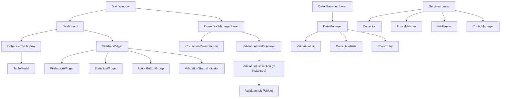
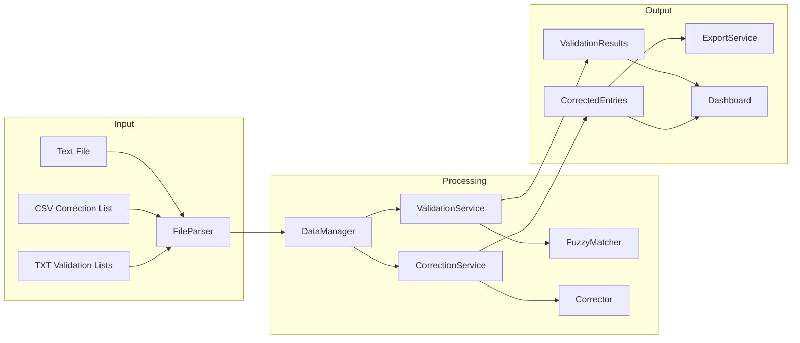
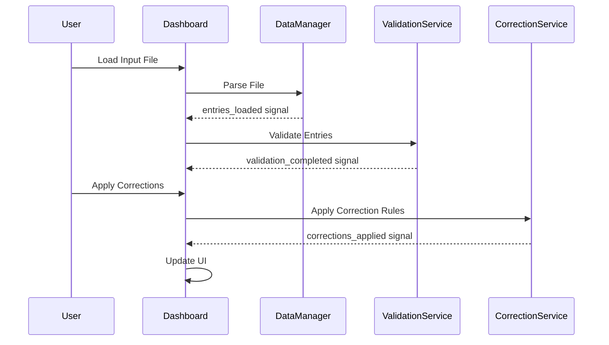

# Chest Tracker Correction Tool - Project Report

## Project Overview
The Chest Tracker Correction Tool is designed to read, process, and correct text input generated by an OCR app for the game "Total Battle". The application aims to fix OCR errors such as wrong characters and bad text encoding based on a correction list provided as a CSV file.

The tool has undergone significant rework to improve its functionality, usability, and appearance, addressing several key issues with the initial implementation.

## Current State
The application has been substantially reworked with a modern, more efficient design:
- Redesigned UI with a dashboard-based approach
- Enhanced validation and correction systems
- Improved file management with auto-loading capabilities
- Refactored codebase with better separation of concerns
- Implemented fuzzy matching for better error detection

## Requirements Summary

### Core Functionality
- Read text input containing chest entries (chest type, player, source)
- Apply corrections based on a CSV template (exact string replacements)
- Support fuzzy matching for similar but not identical errors
- Implement a scoring system for error detection confidence (configurable)
- Allow manual corrections and additions to the correction list
- Process multiple files while maintaining date-based organization
- Generate correction statistics and reports

### User Interface
- Modern, sleek UI using PySide6
- Dark blueish-purple theme with golden accents
- Left navigation sidebar with dashboard-style design
- Content area split with left sidebar (~30%) and main content area (~70%)
- Enhanced table view with validation error highlighting
- Consolidated interface with minimal redundancy

### Data Management
- Support for validation lists (players, chest types, sources)
- Import/export functionality for correction lists and validation lists (CSV and TXT formats)
- Configuration management to remember user settings
- Multi-file batch processing with file integrity preservation

## Implementation Details

### Redesigned Architecture

The application has been redesigned with a more streamlined architecture:



### Data Flow Architecture



### Signal Flow for Key Operations



### Main Components

#### Dashboard
The Dashboard is the primary workspace, replacing multiple tabs from the original design. It features:
- A left sidebar with essential controls and statistics
- A main area with an enhanced table view
- Streamlined workflow with clear visual feedback

#### Correction Manager
The Correction Manager provides a dedicated interface for managing validation lists and correction rules:
- Split layout with correction rules on the left and validation lists on the right
- Direct editing of correction rules and validation lists
- Import/export functionality for all lists

#### Enhanced Services
- **FuzzyMatcher**: Improved with caching and better integration with validation
- **Corrector**: Streamlined with more consistent correction application
- **DataManager**: Enhanced with better state management and signal handling
- **FileParser**: Updated to support different file formats for validation lists

## Test Suite

The application includes a comprehensive test suite to verify functionality and prevent regressions:

### Test Overview
- Tests are located in the `/tests` directory
- Tests use Python's standard `unittest` framework
- Sample data for testing is stored in `/tests/sample_data`

### Key Test Files

#### `test_all_validation_list_fixes.py`
A comprehensive test suite that verifies all validation list functionality:
- CSV file import for correction lists
- Text file import for player, chest type, and source lists
- Input data loading and validation

#### `test_load_validation_lists.py`
Tests the DataManager's ability to load validation lists:
- Loading default validation lists from sample data
- Verifying list types and entry counts
- Error handling for missing files

#### `test_app_startup.py`
Verifies that validation lists are properly loaded at application startup:
- Initialization of the DataManager
- Default list loading
- Validation of loaded lists

#### `test_player_text_import.py`
Specifically tests the ability to import player lists from plain text files:
- Creation of temporary test files
- Validation list loading from text
- Verification of loaded entries

### Running Tests
Tests can be run individually using the Python interpreter:
```
python tests/test_all_validation_list_fixes.py
```

Or as a batch using a test runner such as pytest.

## Implementation Plan Progress

### Completed Phases
- [x] **Phase 1: Preliminary Cleanup**
  - Removed redundant UI components
  - Created stubs for new UI components
  - Updated file import to auto-load correction lists

- [x] **Phase 2: Dashboard Redesign**
  - Restructured dashboard layout
  - Implemented enhanced table view
  - Fixed correction application issues

- [x] **Phase 3: Correction Manager Implementation (Partial)**
  - Created new Correction Manager tab
  - Implemented split layout
  - Added correction rules section
  - Added validation lists sections

- [x] **Phase 4: Fuzzy Matching Implementation**
  - Enhanced ValidationList class for fuzzy matching
  - Connected validation strictness settings
  - Added UI controls for fuzzy matching
  - Implemented fuzzy correction suggestions

- [x] **Phase 7: Visual Design Updates**
  - Defined new color scheme
  - Created consistent button styling
  - Redesigned tables and UI elements
  - Implemented vertical sidebar

### Pending Phases
- [ ] **Phase 3: Correction Manager Implementation (Remaining)**
  - Implement dropdown selection for validation lists
  - Add direct editing of validation list entries
  - Create unified controls for validation lists

- [ ] **Phase 5: Drag-and-Drop Functionality**
  - Implement drag from validation lists to correction rules
  - Enable drag between validation lists
  - Add confirmation dialog for new entries

- [ ] **Phase 6: Filter Improvements**
  - Create dropdown filters from validation lists
  - Implement multi-select filtering
  - Add search functionality to filters

- [ ] **Phase 8: State Management & Consistency**
  - Refactor validation/correction workflow
  - Implement automatic validation on data load
  - Add clear user feedback for operations

- [ ] **Phase 9: Testing & Polishing**
  - Test entire workflow with real data
  - Identify and fix edge cases
  - Optimize performance for large datasets

## Technology Stack
- Python 3.10+ for core logic
- PySide6 for the GUI
- FuzzyWuzzy library for fuzzy matching
- ConfigParser for configuration management
- Python-csv for handling CSV files

## Updated Project Structure
```
chest_tracker_correction_tool/
├── main.py                       # Entry point
├── config.ini                    # Configuration file
├── docs/                         # Documentation 
│   ├── app-report.md             # Project report
│   ├── app-plan-rework.md        # Rework planning document
│   ├── bugfixing.mdc             # Bug tracking and fixes
│   ├── component-breakdown.md    # Component details
│   └── todo.mdc                  # Task tracking
├── src/
│   ├── models/                   # Data models
│   │   ├── __init__.py
│   │   ├── chest_entry.py        # ChestEntry model
│   │   ├── correction_rule.py    # CorrectionRule model
│   │   └── validation_list.py    # ValidationList model
│   ├── services/                 # Business logic
│   │   ├── __init__.py
│   │   ├── config_manager.py     # Configuration management
│   │   ├── data_manager.py       # Data management service
│   │   ├── file_parser.py        # File parsing
│   │   ├── corrector.py          # Correction logic
│   │   └── fuzzy_matcher.py      # Fuzzy matching
│   ├── ui/                       # User interface
│   │   ├── __init__.py
│   │   ├── main_window.py        # Main application window
│   │   ├── dashboard.py          # Main dashboard component
│   │   ├── correction_manager_panel.py  # Correction management
│   │   ├── file_import_widget.py        # File import controls
│   │   ├── validation_panel.py          # Validation panel
│   │   ├── validation_list_widget.py    # Validation list widget
│   │   ├── enhanced_table_view.py       # Enhanced table view
│   │   ├── correction_rules_table.py    # Correction rules table
│   │   ├── statistics_widget.py         # Statistics display
│   │   ├── action_button_group.py       # Action buttons
│   │   ├── validation_status_indicator.py  # Validation status
│   │   ├── styles.py                    # UI styling
│   │   ├── entry_edit_dialog.py         # Entry editing
│   │   ├── validation_rule_editor.py    # Rule editing
│   │   ├── settings_dialog.py           # Settings dialog
│   │   ├── settings_panel.py            # Settings panel
│   │   ├── report_panel.py              # Reporting panel
│   │   └── help_panel.py                # Help documentation
│   └── utils/                    # Utilities
│       ├── __init__.py
│       └── constants.py          # Application constants
└── tests/                        # Test directory
    ├── __init__.py
    ├── test_all_validation_list_fixes.py   # Comprehensive validation test
    ├── test_load_validation_lists.py       # Validation list loading test
    ├── test_app_startup.py                # App startup validation test
    ├── test_player_text_import.py         # Player list import test
    ├── test_models.py                     # Model tests
    └── sample_data/                       # Test data
        ├── input_samples/                 # Sample input files
        ├── correction_samples/            # Sample correction lists
        └── validation_samples/            # Sample validation lists
```

## Known Issues and Fixes
- Fixed signal loop prevention in Dashboard class
- Improved validation list loading to handle both CSV and TXT formats
- Enhanced correction application to be more consistent
- Fixed UI responsiveness issues in the Dashboard

## Future Enhancements

Beyond the pending phases of the rework plan, future enhancements may include:

- Adding support for additional file formats (JSON, Excel)
- Implementing advanced filtering with regex support
- Adding data visualization for entry statistics
- Creating a plugin system for custom correction rules
- Adding support for batch processing multiple files
- Implementing cloud synchronization for validation lists and rules

