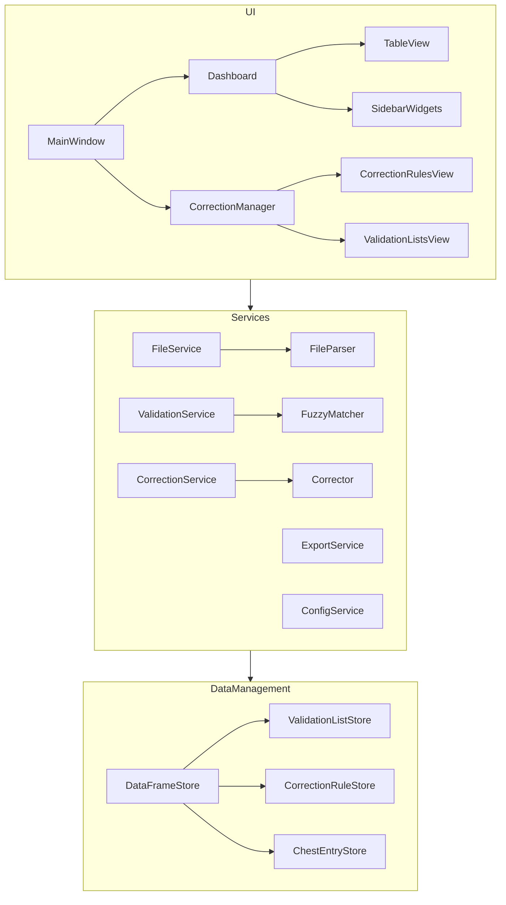
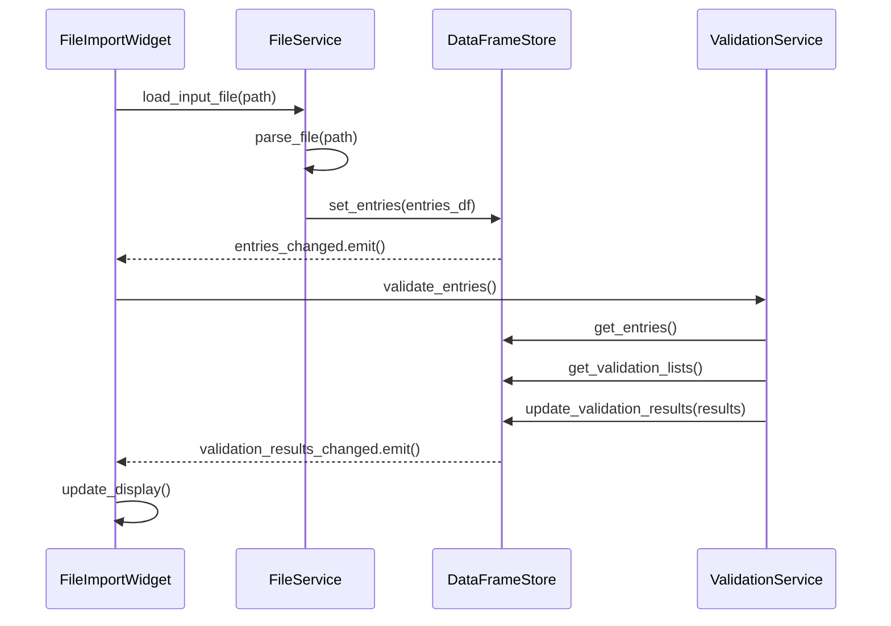
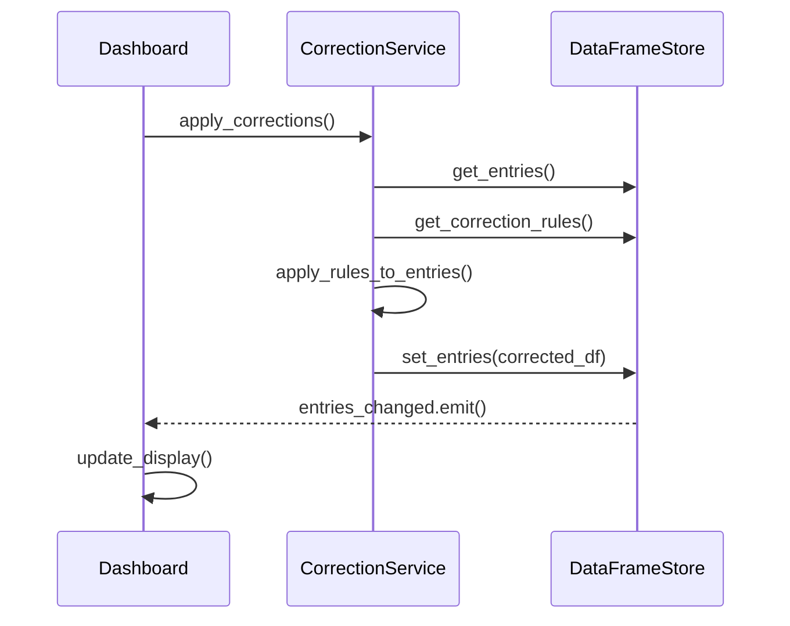

# System Patterns: Chest Tracker Correction Tool

## Architecture Overview

The application follows a layered architecture with clear separation of concerns:



## Core Design Patterns

### 1. Centralized Data Store Pattern
- All application data is managed through a central `DataFrameStore` class
- Components request data through well-defined interfaces
- Updates propagate through signals to dependent components
- Pattern implementation:
  ```python
  class DataFrameStore:
      def __init__(self):
          self._entries_df = pd.DataFrame()
          self._correction_rules_df = pd.DataFrame()
          self._validation_lists = {}
          # Signals
          self.entries_changed = Signal()
          self.correction_rules_changed = Signal()
          self.validation_list_changed = Signal(str)  # list_type
  ```

### 2. Adapter Pattern
- Data transformations between different formats are handled by adapter classes
- Examples: `TableModelAdapter`, `FileParserAdapter`, `ValidationAdapter`
- Isolates transformation logic from core business logic
- Pattern implementation:
  ```python
  class TableModelAdapter:
      def __init__(self, data_store):
          self._data_store = data_store
          self._model = CustomTableModel()
          
      def update_model(self):
          df = self._data_store.get_entries()
          # Transform DataFrame to model data
          self._model.update_data(transformed_data)
  ```

### 3. Service Pattern
- Business logic is encapsulated in service classes
- Services are responsible for specific domains of functionality
- Components depend on service interfaces rather than implementations
- Core services: `ValidationService`, `CorrectionService`, `FileService`, `ConfigService`
- Pattern implementation:
  ```python
  class CorrectionService:
      def __init__(self, data_store):
          self._data_store = data_store
          
      def apply_corrections(self, entries_df=None):
          # Get correction rules
          rules_df = self._data_store.get_correction_rules()
          # Get entries (or use provided)
          entries_df = entries_df or self._data_store.get_entries()
          # Apply corrections and return updated entries
          # ...
  ```

### 4. Observer Pattern (Implemented via Qt Signals)
- Components subscribe to change notifications via signals
- Decouples data producers from consumers
- Ensures UI updates reflect the current application state
- Pattern implementation:
  ```python
  # Signal definition
  entries_loaded = Signal(object)  # DataFrame
  
  # Connection
  data_manager.entries_changed.connect(self._on_entries_changed)
  
  # Handler
  def _on_entries_changed(self, entries_df):
      # Update UI with new data
  ```

### 5. Command Pattern
- User actions are encapsulated as command objects
- Facilitates undo/redo functionality and batch operations
- Example: `CorrectionCommand`, `ValidationCommand`
- Pattern implementation:
  ```python
  class CorrectionCommand:
      def __init__(self, entry_id, field, old_value, new_value):
          self.entry_id = entry_id
          self.field = field
          self.old_value = old_value
          self.new_value = new_value
          
      def execute(self, data_store):
          # Apply correction
          
      def undo(self, data_store):
          # Revert to original value
  ```

## Key Technical Implementations

### Data Management with pandas
- All core data is stored in pandas DataFrames
- Data transformations use pandas functionality (filtering, grouping, etc.)
- Example implementation:
  ```python
  def filter_entries(self, filters):
      df = self._entries_df.copy()
      for field, value in filters.items():
          if value:
              df = df[df[field] == value]
      return df
  ```

### Fuzzy Matching System
- Implemented using the `difflib` and `fuzzywuzzy` libraries
- Configurable thresholds for match confidence
- Score-based ranking of potential matches
- Example implementation:
  ```python
  def find_closest_match(self, value, valid_list, threshold=80):
      if not value or not valid_list:
          return None, 0
          
      # Get the closest match using difflib
      best_match, score = process.extractOne(value, valid_list)
      
      if score >= threshold:
          return best_match, score
      return None, score
  ```

### Configuration Management
- INI-based configuration using `ConfigParser`
- Handles paths, settings, and UI state
- Includes migration mechanism for backwards compatibility
- Example implementation:
  ```python
  def get_path(self, path_key, default=None, create_if_missing=False):
      value = self._config.get('Paths', path_key, fallback=default)
      
      # Legacy path support
      if not value and path_key in self.PATH_MAPPINGS:
          old_section, old_key = self.PATH_MAPPINGS[path_key]
          value = self._config.get(old_section, old_key, fallback=default)
          
      if create_if_missing and value and not os.path.exists(value):
          os.makedirs(value, exist_ok=True)
          
      return value
  ```

## File Structure

The codebase follows a modular structure divided by functionality:

```
src/
├── models/          # Data models and stores
│   ├── dataframe_store.py
│   ├── validation_list.py
│   └── correction_rule.py
├── services/        # Business logic
│   ├── file_service.py
│   ├── validation_service.py
│   ├── correction_service.py
│   └── config_service.py
├── ui/              # User interface components
│   ├── main_window.py
│   ├── dashboard/
│   │   ├── dashboard_panel.py
│   │   ├── sidebar_widget.py
│   │   └── enhanced_table_view.py
│   └── correction_manager/
│       ├── correction_manager_panel.py
│       ├── correction_rules_table.py
│       └── validation_list_widget.py
└── utils/           # Utilities and helpers
    ├── file_parser.py
    ├── fuzzy_matcher.py
    └── constants.py
```

## Component Interaction Flow

### Loading and Processing Input File



### Applying Corrections



## Performance Considerations

1. **DataFrame Operations**
   - Avoid in-place modifications (use `copy()` before modifications)
   - Use vectorized operations instead of loops
   - Create indexes for frequently filtered columns

2. **Memory Management**
   - Clear unused DataFrames
   - Implement lazy loading for large datasets
   - Use appropriate datatypes to minimize memory usage

3. **UI Responsiveness**
   - Throttle update signals for frequent operations
   - Use QThreads for long-running tasks
   - Implement pagination for large datasets 